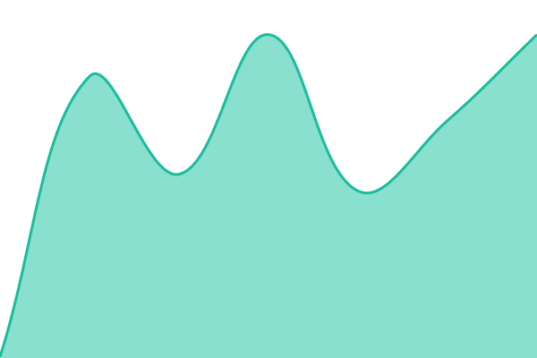

# [📈 Live Status](https://status.vibecheck.luxury): <!--live status--> **🟧 Partial outage**

This repository contains the open-source uptime monitor and status page for [matthewsextonlcsw-sudo](https://status.vibecheck.luxury), powered by [Upptime](https://github.com/upptime/upptime).

With [Upptime](https://upptime.js.org), you can get your own unlimited and free uptime monitor and status page, powered entirely by a GitHub repository. We use [Issues](https://github.com/matthewsextonlcsw-sudo/status/issues) as incident reports, [Actions](https://github.com/matthewsextonlcsw-sudo/status/actions) as uptime monitors, and [Pages](https://status.vibecheck.luxury) for the status page.

<!--start: status pages-->
<!-- This summary is generated by Upptime (https://github.com/upptime/upptime) -->
<!-- Do not edit this manually, your changes will be overwritten -->
<!-- prettier-ignore -->
| URL | Status | History | Response Time | Uptime |
| --- | ------ | ------- | ------------- | ------ |
|  [VibeCheck app](https://app.vibecheck.luxury/api/health) | 🟥 Down | [vibe-check-app.yml](https://github.com/matthewsextonlcsw-sudo/status/commits/HEAD/history/vibe-check-app.yml) | 

 279ms
     
 | 

<a href="https://status.vibecheck.luxury/history/vibe-check-app">98.93%</a>
    

|  [VibeCheck EMR](https://emr.vibecheck.luxury/healthz) | 🟥 Down | [vibe-check-emr.yml](https://github.com/matthewsextonlcsw-sudo/status/commits/HEAD/history/vibe-check-emr.yml) | 

 295ms
     
 | 

<a href="https://status.vibecheck.luxury/history/vibe-check-emr">98.94%</a>
    

|  [vibecheck.luxury (marketing)](https://vibecheck.luxury) | 🟩 Up | [vibecheck-luxury-marketing.yml](https://github.com/matthewsextonlcsw-sudo/status/commits/HEAD/history/vibecheck-luxury-marketing.yml) | 

 243ms
     
 | 

<a href="https://status.vibecheck.luxury/history/vibecheck-luxury-marketing">100.00%</a>
    

<!--end: status pages-->

[**Visit our status website →**](https://status.vibecheck.luxury)

## 📄 License

- Powered by: [Upptime](https://github.com/upptime/upptime)
- Code: [MIT](./LICENSE) © [Anand Chowdhary](https://anandchowdhary.com)
- Data in the `./history` directory: [Open Database License](https://opendatacommons.org/licenses/odbl/1-0/)
